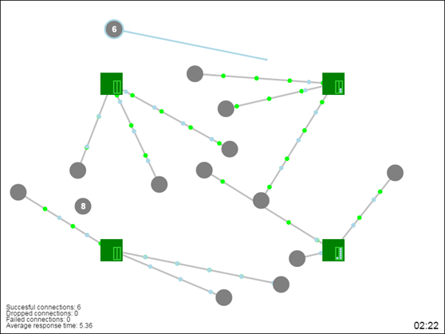
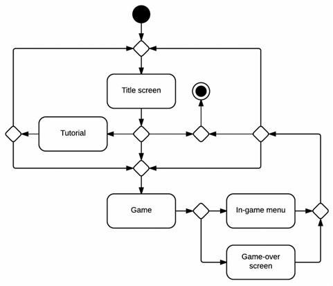

# Load Balancing: The Game - The Design Document

> This is a design document produced at the start of my project in 2015. It was originally written in Word, so I just converted it to markdown and removed some personal information. Everything else is left as it was.

## Introduction
This document describes the design ideas for the improvement of the game *Load Balancing: The Game*.
The game, for now just a prototype, was developed while I was working at a start-up company that operates in the field of DNS and networking, for the purpose of explaining the challenges of DNS load balancing.
For the rest of the document the start-up company will be referred to as "the stakeholder".

## Game description
In *Load Balancing: The Game* the user takes up the role of a load balancer, with the task of  distributing the requests coming to a service to its different servers while minimizing the load on each server.
The game is thought to be played by potential customers of the stakeholder, which generally have some knowledge of the game’s domain.
It should however be playable by (and appealing to) people who have possibly no networking knowledge at all.

The game was originally made as a showcase to capture people's attention and interest during a networking convention, where the stakeholder was present with a booth.
What it should become is a more complete game, to put on the stakeholder’s website in order to provide a lightweight way of explaining to the website’s visitors what the company does.

*Load Balancing: The Game* was realized with HTML5 and JavaScript, the choice of these technologies will not change for implementing the improvements, as those are the perfect tools for a game that has to be uploaded on a website.

In this section I first describe the game as is and then move on to the desired improvements.

### Existing game
The existing game consists of three screens: the title screen, the game itself and the game-over screen.

The **title screen** at the moment is there just to avoid dropping the user immediately into the game and, other than the title, consists only of the button “Start”, that starts a new game.

The **game screen** can be seen in *Figure 1*; there, the green squares represent the servers, the grey circles represent the clients, the lines represent the connections between them and finally the little circles represent the messages exchanged. The messages can be light blue for a request and either green or red for, respectively, a good or a bad response.

The clients that are not connected to a server have a counter on them, the player has to connect them before the counter reaches zero or the connection will fail. To connect a client to a server, the player has to click on it and drag the connection to the server he deems more appropriate.
While doing this the selected client will be highlighted and a temporary light blue connection will be formed between the client and the mouse pointer.
If the player clicks on a server the connection will be actually created and the line will become grey.

When a client gets connected to a server, it starts sending requests (light blue dots) and waiting for the server’s responses.
The servers take some time to compute the responses before sending them out as good responses (green dots); if a server receives a request before having finished with the previous one, it stores the new request in a queue, represented by the light green rectangles on the servers; the queue is resolved in a first in first out fashion.
If a server’s queue is full, upon receiving a new request, the server discards the request and immediately sends out a bad response (red dot).
A client that receives a bad response will send the corresponding request once again, however after receiving too many bad responses it will drop the connection.
When a client is able to send out all of his requests and receive an equal number of good responses, the game will consider it a successful connection.

To recap, a client appearing on the screen can result in:
- a **successful connection** if the client is able to successfully communicate with a server;
- a **dropped connection** if the client receives too many bad responses;
- a **failed connection** if the player does not connect the client to a server fast enough.

When one of these events happens to a client, the client will end its role and disappear from the screen.

Successful, dropped and failed connections are counted and, along with the average response time, will determine the final score of the game. The counters are displayed in the bottom left of the screen.

> *Figure 1: a screenshot of the existing game. Green squares are servers, gray circles are clients, lines are client-server connections and dots are messages exchanged along those connections.*

The game lasts for three minutes, after which the player is brought to the game-over screen; the countdown is shown in the bottom right of the screen.
During these three minutes the game becomes progressively harder by increasing the clients’ spawn rate and by issuing some DDoS attacks, where some malicious clients appear and automatically connect to random servers, flooding them with fake requests.

The **game-over** screen shows the final score, together with the final result of each counter; it also allows the player to start another game or to go back to the title screen.

### Improvements
Currently the game can be played a couple of times before starting to become a bit dull and repetitive.
What I want to achieve with this project, is to improve it and make it more appealing, increasing the player’s engagement and motivation to play.
To do so I, after an informal talk with the stakeholder, defined some features to be added, which will be listed in the following paragraphs.

#### Tutorial
As of now, in order to understand the game, people need to be introduced to it by somebody, who has to explain what the symbols that appear on the screen actually represent.
This was no problem, as the game was initially made to appear during a conference, where the stakeholder would invite attendees to play and explain it to them.

If the intention, though, is to release the game to the public (*e.g.* on the stakeholder’s website), players should be able to play the game and understand its metaphor by themselves.
The tutorial would then serve as an introduction to the game, explaining its principles and mechanics and teaching the player how to play it. The tutorial should also be skippable, because people who already did it usually do not want to do it all over every time they play. Thus, a nice way of including it would be to add a new button on the title screen, before the “Start” button, which will lead to a new screen, and begin the tutorial.

After the tutorial is completed, the player should be able to return to the title screen or directly start playing the game.

#### Popularity system
As explained in the previous section, the game ends on its own after 3 minutes of play and its difficulty constantly increases over time, this is not too much entertaining.
In order for the player to be more engaged, the length of the game and its difficulty should be dependant on the way he plays, for example if he plays well he should have the possibility to make the game last longer.

This is where the popularity comes into play.
In the real world, if an Internet service is good, it becomes more and more popular, gaining more users and more revenues.
Of course the new users create more traffic, thus making the load balancing more difficult, but they also generate more revenues, which will help improving the service.

What right now is the score will become the popularity (although the formula that calculates it will probably need some tweaks), and it will decide when the game ends and how difficult it is; specifically the game ends if the user’s popularity drops below zero and the game’s difficulty will increase with the player popularity.
When the popularity decreases, though, the difficulty should not decrease proportionally, the player could otherwise end up stuck in a medium-difficulty and medium-popularity infinite game.
Picture this, when the player reaches a difficulty too high for him, he would start to lose in popularity, now if the difficulty was to drop proportionally to the popularity, the game would soon become easy enough for the player, who will then increase his popularity until, once again, the game becomes too difficult for him, forcing him to be stuck in this loop until he is too frustrated to play anymore.
The difficulty should instead drop slower than the popularity to avoid this and to still allow the game to end at some point.
Ideally dropping the popularity below zero should be unavoidable after more or less ten minutes of play, maybe fifteen if the player is really skilled.

This unevenness between popularity and difficulty is more or less reflected in the real world as well, where a popular service which cannot keep up with its users does not necessarily lose them as fast as it gained them; a lot of people in fact would still keep using the service in the hopes of it improving again or just because they are too used to it.

#### Upgrades system
Right now in the game there are always four servers with constant computation power (*i.e.* how fast they can process requests) and memory (i.e. the size of their requests queue).
To engage more the user, and to reflect the growth of Internet services in the real world, the game should allow the player to improve its service by changing these constants; in the specific the player should be able to:
- Buy a new server (the game will start with just one instead of four);
- Improve the computation power of a server;
- Improve the memory of a server.

A service in the real world is able to upgrade its software and hardware only if it has enough revenue (or by making an investment, but for simplification let’s avoid this aspect). The revenue in-game will be decided by the popularity score and it will work with thresholds, meaning that after reaching a certain threshold in popularity, the player will unlock a new upgrade.
At each threshold the player will have to make a choice between one of the three upgrades listed above and he will have to wait for the next threshold before obtaining a new one.
This way the game will gain in replay value, the player will be able to decide on his own if he would rather have a lot of cheap servers scattered around, just a few very performing servers that handle everything or maybe a bit of this and a bit of that.

#### In-game menu and pause
The game right now cannot be paused, which is not good.
Again, it was okay for the original purpose of the game, and it could be acceptable in a three minutes long game, but the plan, as discussed above, is to make it more into a game and less into a showcase; we do not want the player to be forced to sit through the whole game without being able to, for example, take a bathroom break or go answer the doorbell.
The player should thus be able to pause the game and bring up an in-game menu, that lets him return to the title screen, restart the game or unpause it.

The game should also automatically pause whenever a popularity threshold is reached, so that the player can choose the upgrade without having to worry about failing connections.

## Game flow
*Figure 2* shows an UML activity diagram representing the game flow. The player starts from the title screen, from there he can then choose to do the tutorial, start a new game or decide to stop playing.
If the player selects the tutorial, after having finished, he will be able to return to the title screen or start playing the actual game.
While playing the game two things can happen: the game ends and the player is brought to the game-over screen or the player pauses the game and the in-game menu is shown.
From both the in-game menu and the game-over screen the player can start a new game (or resume the current one if he paused), go back to the title screen or decide to stop playing.

Considering that this is a browser game, the player can always decide to close the browser window, but this is not part of the game flow so it is not captured in the diagram.

> *Figure 2: UML activity diagram representing the game flow.*

To summarize, there will be a total of five game screens:
- The title screen;
- The game;
- The game-over screen;
- The tutorial;
- The in-game menu.

The first three are already present and just need enhancing, the last two need to be implemented from scratch.

### The Game activity
*Figure 2* showed how the player navigates through the various game screens and in general the flow that can be followed at a high level.
The activity called “Game” might need some more in depth analysis, so I will include a step-by-step list of how a game can proceed from start to finish.
1. The game starts with one server
2. Clients start to appear on the screen
3. The player tries to connect each client to a server
4. The popularity changes depending on the player’s performance
    - if he is able to connect the majority of the clients or even all of them, the popularity rises
    - if he has a lot of dropped and failed connections, the popularity lowers
    - the rate of growth or decline are weighted by the average response time (a low response time means a faster growth and a slower decline and vice versa)
5. As the popularity changes some events can happen
    - The popularity grows to a new threshold and the player can select an upgrade (buy a new server, improve the memory of a server or improve the computation power of a server)
    - The popularity declines to an old threshold and the player has to renounce to an upgrade that was previously acquired
6. The game difficulty changes depending on the popularity
    - it rises proportionally to the popularity
    - it decreases slower than the popularity
7. The likelihood of a DDoS attack is dependent as well on the popularity. The higher the popularity, the higher the chance of getting attacked
8. Once the popularity reaches 0 the game ends
    - The final score is given by how long the player was able to “survive”

## Art
Right now the game looks are very minimalistic and I intend to keep them this way for two main reasons: the first one is that I like it this way, I think this style is in line with the stakeholder’s way of presenting itself and a good way of making it look more professional, while still not giving the impression of being shabby.
Indeed the stakeholder's software was recently redesigned and restyled in part because the clients thought it looked too much “cartoony”; albeit a game could be excused for being more artistic than a professional software, I still think the minimalistic look fits it better and I do not want to risk taking another path.
The second reason is that I am working alone and I am more a programmer than an artist; creating art for the game would mean dedicating a lot of time to it, and likely it would involve a lot of trial and error, since, being inexperienced, I would probably not be able to create something satisfactory on the first try.
In fewer words, I do not want to bite more than I can chew.

The same reasoning goes for the sounds and music, with the difference that there are plenty of free sounds repositories online and I might decide to include some effects and background music if I have time.
Having some auditory feedback is generally a good thing and background music usually improves the player’s experience.
This however remains as a nice-to-have requirement and will only be implemented when everything else is done.
