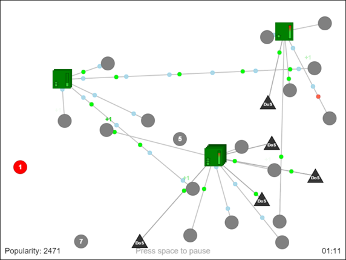
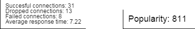
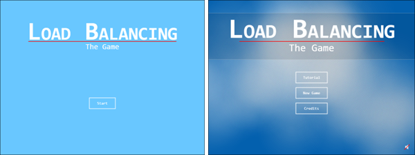
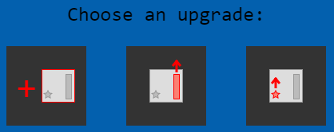
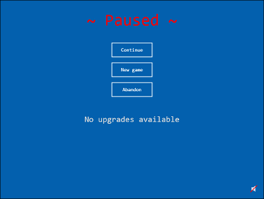

# Load Balancing: The Game - The Report

> This is a report produced at the end of my project in 2015. It was originally written in Word, so I just converted it to markdown and removed some personal information. Everything else is left as it was.

## Introduction
This document contains a report on the improvement and evaluation of the game *Load Balancing: The Game*.

The game was just a prototype, developed while I was working at a start-up company that operates in the field of DNS and networking, for the purpose of explaining the challenges of DNS load balancing.

The purpose of the project was to improve the prototype and make it into a complete game and then to gather some feedback from people belonging to the target group at which the game is aimed.
The game will then be adjusted according to the feedback and eventually published on the company’s website. The adjustment and publishing are not part of the project so will not be covered in this document.

The project was divided into two major development-evaluation cycles, in order to proceed incrementally with the improvements: the first cycle included the implementation of some new features and then an internal evaluation with the stakeholder (*i.e.* the people from the company); the second cycle included fixing the problems and quirks found by the stakeholder and a final evaluation with target users.

This document will continue with a description of the game as it was and as it is now and the two evaluation processes. It will then present some conclusions and ideas for the future.

## Load Balancing: The Game
As the name might suggest, in *Load Balancing: The Game* the player takes up the role of the load balancer[^1] of a web service.
The player’s objective will be to distribute the requests that the service receives to its various datacenters, trying to minimize the load of requests that each datacenter will have.
The service is also at the risk of undergoing DDoS attacks that can drastically increase the load of one or more datacenters.
After a fixed amount of time the game ends and the player gets a score based on his or her performance.

The prototype was developed using JavaScript and HTML5, with no external libraries.
There are some JavaScript libraries for game development out there, however I chose not to use them since the project was small enough.
This also gave me the opportunity to improve my JavaScript knowledge.
This setup didn’t change during the project because JavaScript and HTML5 are the perfect tools for a game that will end up on a website and, since the core parts of the game are already developed, introducing an external game engine right now would be a bit redundant.

### Goal
The game was initially developed in order to appear at an exposition where the company had a booth.
There it served as a device to obtain the bystanders’ attention, engage them into a conversation and explain to them the hardships of load balancing and thus the need for a company like the stakeholder's and its software.
Since the game performed reasonably well at the exposition, the company decided to not stop there and furtherly improve it with the aim of publishing it on its website.
On the website the game will serve a similar purpose as before: it will be a way of intriguing the website visitors and make them aware of the company’s area of competence.
It will basically be an innovative and cool way of presenting a product to be used alongside long boring texts and quirky catchphrases to enhance the visitors’ experience. Of course it will not completely replace those two features typical of contemporary websites: it is still important to have an exhaustive in depth documentation for a product and well thought catchphrases can do a very good job at creating a good first impression. A lot of websites designers create videos in order to support the textual content of their website. The game will have a role similar to that of a video, but with the added benefit of being interactive and more original.

The idea of *Load Balancing: The Game* takes some inspiration from *Mini Metro*[^2], a game where you have to manage the subway lines of a growing city: as the game progresses, the number of lines, stations and commuters increases and the difficulty inevitably rises along with it.
The game is just a game, that is it has no serious or promotional purpose, however two things make it relevant and worth mentioning: one is that it has a free version which is playable online and it being one of those games addicting in their simplicity means that the players will likely play more than once, thus generating more traffic for the website that hosts it; the second reason is that with its rising difficulty it really makes you understand how hard it can be to manage a complex underground system.
Since *Load Balancing: The Game* aims at engaging the website users (*i.e.* create more traffic) and making them understand the challenges of managing a complex network it is easy to see why those two features of the game are relevant.

### User study
As already mentioned before, the aim of *Load Balancing: The Game* is to end up on the stakeholder’s website.
This means that the main target users group is composed of the website’s visitors.
This, however, is a very loose definition, since the website is public and thus potentially any kind of person could visit it. More so, designing a game for such a broad and differentiated audience is not smart nor feasible, especially if the game has some serious purposes and you have a limited amount of man-hours.

The company operates in a very specific field, so in reality it is rare for its website to have visitors that are completely outside of this field and, in those rare cases, the visitors are most certainly not potential customers for the company, which means that they are less important to engage.

This reasoning brought to the narrowing of the set of target users to the visitors of the website who work in the same field as the stakeholder and that can be potential customers or partners.
The most likely customers for the stakeholder are domain name registrars and hosting companies that do not want to manage their DNS internally, for example because they don’t have enough resources to do it or don’t have employees skilled enough in the field.
Potential partners are other companies or organizations that operate in the field but don’t need the company’s software.
This category is part of the set of target users because the company is still young and in need of visibility and not just of customers.
Getting noticed by already established companies is important for growing and indeed it is through networking, for example, that recently the stakeholder has become an active member of RIPE[^3].

The people that belong in this set are definitely more homogeneous: they are professionals generally between 25 and 50 years old, mostly males; they usually have a degree in Computer Science or Engineering; they have at least some basic knowledge of computers and networking even if they don’t necessarily know in depth information about DNS and load balancing; they are likely to have some experience with videogames, albeit they might no longer be playing them as frequently as when they were younger.

#### Persona
Given the target users group description, I created a persona that represents this user base.
Personas are a concept first introduced by Alan Cooper in his famous book *The inmates are running the asylum* [Cooper 1999].
A persona is a fictitious person that serves as an archetype for the average user of a system.
Since their first appearance, personas have been widely used by usability designers and testers and some scientific literature has been written about them and their effectiveness [Pruitt et al. 2003] and there are even researchers trying to define a framework for guiding their usage in requirements engineering [Aoyama 2005].

For big systems with a non-specific audience (*e.g.* an online bookstore or a banking platform) one would usually define more than one personas, in order to represent different typologies of users, in this case however the set is narrow enough that one should be enough, especially taking into account the scope and time schedule of the project.

---
**Jerome King**

> “I don’t get all the love for Macs, why does nobody use Linux?”

Jerome has always had a passion for computers, at least since his older brother got a Commodore as a present many many years ago.
He still fondly remembers the long waiting times and the wonders of the first computer games.

This passion is what led him to pursue a Computer Engineering bachelor.
After obtaining his bachelor he didn’t follow the academic path, since he liked more doing practical stuff rather than research.
He instead found a job as a developer.
While working as a developer he discovered the joys of managing networks and computer systems.

He now, at the age of 32, is a system administrator for an emerging hosting company, he spends his days configuring servers and solving computer problems for the less tech savvy guys in the company.

He doesn’t have much free time and spends almost all of it on his other great passion: football. He’s a huge fan and tries to go to every match of his favorite team with his friends.
He even has a ball with the autographs of every player in the team.

Despite having been an avid videogame player in his adolescence, he almost never plays nowadays, he spends too much time in front of a computer at work, so when he gets home he doesn’t feel like turning on another screen.
When they can’t go to the stadium or there is no interesting match on TV, he and his friends sometimes still play some FIFA during weekends, but it’s more about the football than the videogames.

He ended on the stakeholder's website after his boss gave him the task of finding a solution for the latency issues that their servers have been experiencing lately.
After verifying that the issue was not in their internal network (of course it wasn’t, he was the one who built it), he got to the conclusion that it was a DNS problem.

He doesn’t know much about DNS, he knows what it is, but it wasn’t covered during his bachelor studies and he never got into it himself.
He is thus looking for somebody that can help him with this issue and he remembered having heard one of his colleagues talking about this company that claims to be have one of the best DNS networks in Europe, so he decided to check it out.

---
> *Table 1: The persona created as a representative of the target users group. Sometimes this descriptions are more schematic and detailed. I decided to follow a more agile approach[^4].*

### Description
Before this project I didn’t have much experience in designing and developing a game, let alone a serious game.
Being a computer scientist the developing part did not scare me too much.
For the design part, however, I needed some help, thus I read the book *Triadic Game Design* [Harteveld 2011], which gives a framework for the design of serious games, accompanying the theory with a real life example based on the author’s experience.

The core of triadic game design —the namesake of the book— is the division of the design in three “worlds”: Reality, Meaning and Play.
Taking into account each world both on its own and in relation with the others is fundamental for designing a functional and engaging serious game.
Explaining this concept is not the aim of this document, so I won’t go any further in that direction, but it was an interesting read at it was worth mentioning.

> *Figure 1: A screenshot of* Load Balancing: The Game *being played.*

*Figure 1* shows a screenshot of the game.
The green squares represent the servers, the grey circles represent the clients, the lines represent the connections between them and finally the little circles represent the messages exchanged.
The messages can be light blue for a request and either green or red for, respectively, a good or a bad response.

The clients that are not connected to a server have a counter on them, the player has to connect them before the counter reaches zero or the connection will fail.
To connect a client to a server, the player has to click on it and drag the connection to the server he deems more appropriate.
While doing this, the selected client will be highlighted and a temporary light blue connection will be formed between the client and the mouse pointer.
If the player clicks on a server the connection will be actually created and the line will become grey.

When a client gets connected to a server, it starts sending requests (light blue dots) and waiting for the server’s responses.
The servers take some time to compute the responses before sending them out as good responses (green dots); if a server receives a request before having finished with the previous one, it stores the new request in a queue, represented by the indicator bar on the servers sprites; the queue is resolved in a first in first out fashion.
If a server’s queue is full, upon receiving a new request, the server discards the request and immediately sends out a bad response (red dot).
A client that receives a bad response will send the corresponding request once again, however after receiving too many bad responses it will drop the connection.
When a client is able to send out all of his requests and receive an equal number of good responses, the game will consider it a successful connection.

To recap, a client appearing on the screen can result in:
- a **successful connection** if the client is able to successfully communicate with a server;
- a **dropped connection** if the client receives too many bad responses;
- a **failed connection** if the player does not connect the client to a server fast enough.

When one of these events happens to a client, the client will end its role and disappear from the screen.

Successful, dropped and failed connections are counted and, along with the average response time, will be weighted to determine the popularity of the service.

The game lasts for five minutes, after which the player is brought to the game-over screen where he is given a score correspondent to the popularity that he managed to reach; the countdown is shown in the bottom right of the screen.
During these five minutes the game becomes progressively harder by increasing the clients’ spawn rate and by issuing some DDoS attacks, where some malicious clients appear and automatically connect to random servers, flooding them with fake requests.

This was a general description of how the game works, in the next two sections the mechanics implemented during the first and second iterations respectively will be further detailed.

#### Improvements during the first iteration
The first iteration was focused on the addition of the most important features and terminated with an internal evaluation with the stakeholder.
The objective was to have a playable first version of the game, see if it respected the stakeholder’s expectations and identify possible changes.

##### Popularity system
In the game prototype the concept of popularity previously mentioned was not present.
On the bottom left of the screen there was not a single counter, but four of them, showing all the elements that now contribute to the popularity *(Figure 2)*.

> *Figure 2: Examples of the counters that  let the player know his score while playing (left: before the first iteration, right: after the first iteration).*

Although this lets the player know better how he is doing, the reason for this choice is not merely aesthetic: initially the score would be computed at the end of the game, now it is constantly updated during the game.
This allows for more variability to be introduced by weighting each random event that can occur with the popularity counter.

In particular before this iteration the spawn rate increase, the number of messages per client and the DDoS attacks strength and timing were all chosen randomly within fixed intervals.
Now these intervals are dependant on the popularity counter so that the game is less predictable and less boring.
More so the difficulty of the game is thus no longer programmatically increased over time (by augmenting the spawn rate of the clients) but dependant on the player’s performance.
A skilled player is rewarded with more popularity but will have to face more traffic, clients that are more demanding and stronger DDoS attacks.

This has also some parallels with a real life scenario, where a successful and popular service has higher traffic, longer visits and a higher likelihood of suffering cyber attacks.

Initially there was also the idea of tying the popularity to the game length.
However, after some study on the possible implementations of this particular feature, it became evident that it was not possible in such short time without the risk of introducing possible game-breaking scenarios, so we decided to just increase the game duration from three to five minutes.

##### Upgrades system
Before this iteration, in the game there were always four servers with constant computation power (*i.e.* how fast they can process requests) and memory (*i.e.* the size of their requests queue).
To engage more the user, and to reflect the growth of Internet services in the real world, I introduced the possibility for the player to improve its service by changing these constants; in the specific the player is now able to:
- Buy a new server (the game will start with just one instead of four);
- Improve the speed of a server;
- Improve the memory of a server.

A service in the real world is able to upgrade its software and hardware only if it has enough revenue (or by making an investment, but for simplification let’s avoid this aspect).
The revenue in-game is represented by the popularity score and works with thresholds, meaning that after reaching a certain threshold in popularity, the player will unlock a new upgrade.
At each threshold the player will have to make a choice between one of the three upgrades listed above and he will have to wait for the next threshold before obtaining a new one.
This way the game will gain in replay value, the player will be able to decide on his own if he would rather have a lot of cheap servers scattered around, just a few very performing servers that handle everything or maybe a bit of this and a bit of that.

The thresholds follow a Fibonacci sequence (*i.e.* the player unlocks a new upgrade at 100, 200, 300, 500, 800… popularity).
This is for no particular reason other than adding a cool reference for attentive players to catch.
After playing a lot and seeing others play, it was also evident that this progression more or less follows nicely the difficulty growth, which means that introducing this “easter egg” doesn’t compromise the game playability.

##### In-game menu and pause
Initially the game could not be paused, which was not good.
It was okay for the original purpose of the game, and it could be acceptable in a three minutes long game, but the plan, as discussed above, was to make it more into a game and less into a showcase; we do not want the player to be forced to sit through the whole game without being able to, for example, take a bathroom break or go answer the doorbell.
This is why I implemented a pause feature and an in-game menu that lets the player return to the title screen, restart the game or unpause it.

The game also automatically pauses whenever a popularity threshold is reached, so that the player can choose the upgrade without having to worry about failing connections.

#### Improvements during the second iteration
The second iteration had as objectives the solution of the issues found during the internal evaluation (see the "Evaluation with the stakeholder" section for the report on the evaluation), the implementation of a tutorial and, if there was some time left, the improvement of the art in the game.

##### Tutorial
In order to understand the game, people needed to be introduced to it by somebody, who had to explain what the symbols that appear on the screen actually represent.
This was no problem, as the game was initially made to appear during a conference, where spokesmen from the stakeholder would invite attendees to play and explain it to them.

If the intention, though, is to release the game to the public, players should be able to play the game and understand its metaphor by themselves.
The tutorial thus serves as an introduction to the game, explaining its principles and mechanics and teaching the player how to play it.

Given the persona that represents the typical players, it is safe to assume that the concepts of clients, servers, and DNS are already known by the player to a certain degree.
The tutorial doesn’t need to convey the hardships of load balancing, since those should become evident while playing the actual game.
This is why the tutorial focuses more on the mechanics of the game, teaching the player what represents what and how to interact with the game and introducing him to the upgrades system.

##### Art
The game looks are very minimalistic.
This is for two main reasons: I am not an expert artist or designer and the game I took most of the inspiration from (*i.e. Mini Metro*) has a minimalistic look as well, which I really like.
However initially the game didn’t look just minimalistic, but also a bit plain, maybe because *Mini Metro*’s looks are taken from the London Underground map and thus are familiar to the player, whereas *Load Balancing: The Game* doesn’t have any real life reference.
This is why we decided to introduce some art improvements as a nice-to-have requirement.

> *Figure 3: starting screen before and after the art improvement (the button on the bottom right corner lets the player turn on and off the music).*

Initially I didn’t think I would have had time to implement them, however luckily (or unluckily depending on how you see it), I had a really hard time finding people close enough to my persona for the final evaluation and thus delayed it for some time.
During this time I was able to improve the art as well.
In particular I:
- Embellished some of the static screens (*i.e.* the title, credits and game over screens) with some random generated clouds flowing in the background (*Figure 3*), since “cloud” is nowadays a term widely used in computer networking and the company’s logo is cloud-shaped.
I also changed the main color, making it a darker blue;
- Introduced some visual cues that let the player know how much each server has been upgraded (*Figure 4*);

> *Figure 4: the visual cues that indicate the upgrades on a server (the stars on the left are for the server’s computation power, the projection on the background for the server’s memory)*

- Replaced the upgrades’ names with some icons during the upgrade selection phase (*Figure 5*);

> *Figure 5: the upgrades icons, the description of an upgrade appears below them when the player passes the mouse over it.*

- Added some background music, the music can be paused on the starting and pause screen.
The music was not composed by me since I have close to none musical knowledge. 
Luckily I have a musician friend[^5] and he accepted to create a song for me in exchange for recognition on the credits screen.

## Evaluation
Similarly to what I said about the design, before this project I didn’t have much knowledge of evaluation either.
To help me with this part I read the book *Interaction Design* [Preece et al. 2015].
It is not just about evaluation, as it talks about all the aspects of design, but it has some extensive chapters that cover all the most important evaluation techniques.
Those chapters helped me in the choices I made while preparing the two evaluations that will be described in the next sections of this document.
The rest of the book is also interesting and well written, so I read it all anyway for personal interest.

### Evaluation with the stakeholder
As mentioned before, the first iteration of this project ended with an internal evaluation with the stakeholder.
The aim of this evaluation was to asses if the requirements were met and if the obtained result was satisfying for their expectations and to find the problems fundamental to resolve before the final evaluation.

In order to achieve this, the first part of the development was focused on implementing all the core mechanics and having a playable game, leaving to the second iteration the parts non essential for the game to work (*i.e.* tutorial and art improvement).

#### Method
The main tool used for this evaluation was the think aloud method.
Jakob Nielsen gives the following definition for this method on his website [Nielsen 2012]:
> *“In a thinking aloud test, you ask test participants to use the system while continuously thinking out loud — that is, simply verbalizing their thoughts as they move through the user interface.”*

That article does a great job in explaining and summarizing the benefits and downsides of the method: it is easily implementable and usually gives good results, although it is not infallible, especially if not used properly [Hughes 2012].

This method has been the topic of various scientific articles, that often try to evaluate it or to extend it.
In [Van Den Haak et al. 2003], for example, the concurrent and the retrospective think aloud methods are compared in a field study.
[Petrie et al. 2010] instead proposes the usage of an “emotion word prompt list” to facilitate the test subject in his thinking aloud and to better categorize and understand their feelings.

#### Execution
This evaluation was conducted with two people, both males and working at the stakeholder's company and both fairly close to the persona modeled as a representation of the target users.
One was in his mid twenties and one in his mid thirties.

They obviously already knew about the game and thus they did not need any introduction to it, they however were briefly explained about the think aloud method before starting.

They were asked to play as many games as they liked and in the mean time to describe what they were trying to do and what they were feeling.
When they stopped playing (both subjects ended up doing more than 5 plays each), we had an informal discussion during which they pointed out what they thought was good and what needed fixing.
During both phases (play and discussion) I took notes of their observations and at the end I let them examine my notes and add to them whatever they felt was missing.

#### Results
Both test subjects gave positive overall feedback on the game: they enjoyed it and played it for some time also outside the evaluation.
They even hanged a scoreboard on the office wall and jokingly bragged about their results via email to other coworkers.
This kind of engagement is what we aim to create once the game is published and, albeit they are the ones who commissioned it and thus there might be a bit of bias and their reaction might not be completely spontaneous, their reaction was definitely a nice sight.

The evaluation itself gave more or less the expected results: the game was judged complete enough to advance to the next iteration after some quick fixes.
The think aloud method helped to identify these fixes and the final discussion was useful in concretizing the ideas expressed during the play session and provided also an opportunity to lay down new ideas for further improvements in the future.
In particular it proved to be very helpful in highlighting some ambiguities and bad word choices that left the player confused.
For example, after selecting an upgrade for the first time one of the subjects said *“What happened? Did it work? What did it do?”* This brought to the addition of the visual cues described previously.
Phrases like *“In the score, it does not matter if a client is served fast or slowly. This should be reflected somehow because that’s also the idea of our product.”* helped in improving the fidelity to the real-life scenario that the game models.

Other problems identified and fixed before proceeding to the next iteration were the following:
- A bug where in certain occasions the servers wouldn’t be deleted after the game was restarted;
- Some change in terminology to be more adherent to the jargon used in the field. In particular the word “server” was changed with “datacenter” and the upgrade “Improve speed” became “Scale off”;
- Tweaked some weighting in the way the popularity gets updated, in order to represent the reality better. For example a dropped and a failed connection in the game gave the same amount of penalty in popularity, however for a business one is worse than the other, so I changed it accordingly;
- Whenever you bought a new datacenter its position would be decided randomly, this caused some unbalancing since if the random position was too close to an existing one, or too close to a corner, this would lead to less usefulness of the datacenter. This was changed so that the game area gets divided into nine rectangles and the player can choose in which one to put the datacenter. Some amount of randomness remains in that the exact position inside the rectangle is still randomly generated;
- When the game was paused, the menu was partially transparent and the screen was still visible, this made it so it was possible to pause the game and carefully study your next move. This feature was not particularly liked, even if one of the subjects exploited it extensively because *“if the game lets me, it’s not cheating!”*. The reason why this was so frowned upon is that the game is trying to make the player see how load balancers can get overwhelmed with traffic, but there is no sense of overwhelming if one can take as much time as he wants. Now when the game is paused the menu that pops up covers completely the screen (*Figure 6*);

> *Figure 6: The pause screen that covers the game area when the player presses the space bar.*

- Initially whenever an upgrade was available the game would pause itself and bring up the menu where the player could select the upgrades.
A lot of times, however, the player was quickly clicking on the screen and he would end up selecting accidentally an upgrade without even seeing it.
I changed it so that when an upgrade is available a blinking text appears at the bottom of the screen saying “Upgrade available!” and the player has to hit the space bar and pause the game on his own in order to select an upgrade.

### Evaluation with target users
The internal evaluation was mainly focused on finding problems and verifying the adherence to the stakeholder's expectations.
Conversely, this one had as a goal understanding if *Load Balancing: The Game* has any appeal to the public and thus if it is worth to spend more time on its improvement and to publish it on the company’s website.
On top of that we also wanted to understand if the game is able to communicate the hardships of load balancing, as explained before.

The reason for wanting to understand both the engagement and the effectiveness of the game is quite straightforward.
Serious game and gamification are relatively new concepts: even if the term “serious game” was introduced before the spread in popularity of electronic games [Abt 1987], serious games became more interesting and subject to studies only with the rise of videogames.
Being such a novelty there is still some debate on the actual definition of a serious game and the classification of the various typologies of serious games (see for example [Susi 2007] and [Breuer 2010]).
Despite this debate, what most of the researchers agree with is that, even if entertainment is not the main focus of a serious game, it still is fundamental for its effectiveness.
Making a game that is not fun to play results in what some people call “chocolate-covered broccoli” [Farber 2014], that is a mischievous trick to make you eat what you actually wouldn’t.

With this in mind, my first idea was to use the same technique used for the previous evaluation: the think aloud method.
I wanted to find two or three people belonging in the target users group and let them play the game while giving voice to their thoughts; during the informal discussion that would have followed, I would have focused my questions more on the two aspects mentioned above as opposed to the first evaluation in which I focused more on the stakeholder’s expectations.
This unfortunately proved to be more difficult than expected, mostly because the time in which I tried to conduct this evaluation was during Summer and the target group is quite specific.
The combination of these two factors made it so that it was really hard for me to find suitable people and that the ones I found were more often than not unavailable.

This period of unsuccess at least gave me the opportunity to improve the art of the game and thus complete the nice-to-have requirements, as detailed before.
I also had time to let the stakeholder try out the tutorial to see if they liked it, which they did — one of the comments was *“It is very simple and explains well the steps of setting up the game.”* — and if they wanted something to be changed before the evaluation, which they did (mostly some wording and a small bug).

After more or less a month of idleness on the evaluation front, an occasion finally was presented to me: the stakeholder was going to have a booth at another exposition, the IP Expo[^6] in London, and they wanted to bring the game with them, as it had done its job nicely at the exposition it was originally developed for.
The event is dedicated to IT companies and has a specific section called “Networks & Infrastructure”, so it was very likely to find people belonging to my target group visiting it.
I thus decided to try to conduct my evaluation there, with those who would stop at the stakeholder’s booth.

#### Method
Conducting the evaluation at an exposition meant that the think aloud method was no longer viable.
This is because it requires at least forty five to sixty minutes per person, counting between the explanation of the method, the playing of the game and the final discussion.
However, people that visit such events are usually in a rush, because there are a lot of things to see and not much time to see them (this event in particular lasted only two days).
This means that if I were to ask for a whole hour of their time they would have probably said no.

This is why I decided to change approach and to settle for a faster, albeit less powerful solution.
I wrote a questionnaire, which is faster to compile than it is to have an informal discussion, and I renounced to explaining the think aloud method, so that there wouldn’t be much introduction to make.
This way, the only time needed was composed of the five minutes of gameplay, plus more or less other five optional minutes if they wanted to play the tutorial, plus a really brief introduction.
Basically this means I could get away with saying that it would take ten to fifteen minutes instead of an hour.

Questionnaires are one of the most used tools for doing research, they allow to gather data fairly quickly and, more importantly, nowadays most of the people are familiar with them, which means they likely won’t need any guidance in compiling them, whereas the think aloud method needs some explaining in order to be successful.
The downside is that a lot of time people answer the questions without giving too much thought to them and tend to avoid open questions unless they are forced to answer them.
The series of papers called *Principles of Survey Research*, started with [Pfleeger 2001], gives a good overview of the dos and don’ts of this subject.

The questionnaire that I prepared was divided into five sections.
The first two are composed respectively of some demographic questions and some questions about the topics of load balancing.
Their function is mainly to assess whether or not the subjects belong to the target group.
The other three sections are dedicated to the evaluation: the first is about the tutorial; since it wasn’t evaluated during the first iteration I felt like having a whole section of the questionnaire for it was justified.
The second is about the game itself; it contains some question about the entertainment provided and some questions addressing the features we had more doubts about (*i.e.* the minimal graphics, the game length and the difficulty).
The last section is about the game’s effectiveness as perceived by the subject, with questions about load balancing, DDoS attacks and the strategy used.
The full questionnaire can be found in *Appendix I*, at the end of this document.

#### Execution
During the exhibition, the stakeholder’s booth was set up with two screens to capture people’s attention: one playing some promotional videos and the other showing the game.
In front of the booth there was always a person handing out informative flyers and giving answers to the questions of interested people.
I would then ask to these people if they wanted to try our new game and help us to improve it.
I would also try to stop with the same question the people that lingered looking at the screens while passing by.

To those who accepted to play the game I would then explain briefly what it was about and suggested playing the tutorial first, but I didn’t force them to do so.
I then told them to feel free to give voice to any comment that popped in their mind, in an attempt to still implement a pseudo think aloud method without having to explain it.

When they finished playing I asked them to fill out the questionnaire.
The answers were automatically saved in a spreadsheet.

I also tried to do some small talk by asking questions such as *“So, did you like it?”*, however I didn’t try to force the conversation since, as I said, most of them were in a hurry.

#### Results
During the two days of exposition I managed to collect seven sets of answers to the questionnaire: three during the first day and four during the second.
The subjects were six males and one female, all except one were working or studying in the IT field and were familiar with the topics of *Load Balancing: The Game*.
All of them were employed or self-employed.
They were fairly spread out on the interest in videogames, ranging from one subject that reported to never play games to one that reported playing them daily.
After analyzing the demographic and the topic related questions it was evident that six out of seven people were close enough to the persona I designed, which is more or less the proportion I was expecting from this kind of event.
In the following paragraphs I will not take into account the answers given by the one outlier.

Five of the six relevant subjects played the tutorial, the one that skipped it didn’t have much time available and preferred to go directly to the game.
In one instance the tutorial encountered a bug and the subject chose to go directly to a new game instead of replaying the tutorial from the beginning.
Overall the subjects felt the tutorial to be necessary for playing the game, they didn’t find it lacking of information, but some thought it was a bit too fast.
One gave it the minimum score on the helpfulness, albeit it is probably the one that encountered the bug.

Four out of six gave a positive score to the game and said that they would like to try it again once it is improved.
Also one of the two subjects that gave a negative score reported that once it gets improved he could give it a second chance.
There were mixed results on the question about the minimalistic graphics and the difficulty growth, with the first being skewed towards it not being too detrimental to the enjoyment of the game.
The subjects were mostly okay with the time limit being there.

Three of the subjects reported positively on the effectiveness part, two of them were negative and one was neutral.
Most of the subjects left the open questions unanswered or gave really brief and not relevant answers.
Following are some answers worth reporting.

**In the game section:**

> “it looks like one of thse addicting games that you can’t stop playing”

This I would say is a good comment.
Mini Metro is definitely one of those games and the fact that one person gave this comment means that I was able to capture at least some of that addictiveness;

> “It still needs A LOT of work, but I see potential.”

This reflects something that some of the subjects told me in person afterwards and partially explains the mixed results on the minimal graphics question.
That is the game looks a bit unfinished and the style looks more like the result of lack of time rather than a conscious choice;

> “complex to start with but fun too.”

This is just some ego boost.

**In the effectiveness section:**

> “At first I tried, but then I didn’t have time to think about it”

This was answering the question about employing any particular strategy and I think it is both good and bad.
It is good because the sense of being overwhelmed is what the game wants to communicate, bad because it shows that people stop thinking about it and just go with the flow.

There were no noteworthy comments in the tutorial section.

## Conclusions
This project took way more time than it was supposed to, partly due to the delays previously described and partly because in the meantime I was still working on other things at the office.
Nonetheless, looking back I am satisfied with it.
Before I had no practical experience in game design and development, nor I had any in evaluation, but now I have a functioning game and I have even tested it.

The final evaluation ended up being quite different from what I was expecting: I embarked in something more time consuming than I would have imagined and in the end I didn’t manage to employ the think aloud method (although I used it for the internal evaluation, I think it was on the final one that it could have really shone).
Still I think it was not a waste of time, the answers to the questionnaire gave some useful information and they showed that the game could fare reasonably well on the stakeholder’s website, maybe not as the main dish, but as a nice bonus feature, which is what it is supposed to become.

The usage of a questionnaire instead of a more thorough method showed to carry both positive and negative traits.
I was able to collect data from a larger number of subjects than what I would have been otherwise able to and it was easier to convince people to take part in the study, probably because people are more willing to engage in a fifteen minutes long survey rather than an one hour long conversation.
On the other hand the collected answers are less exhaustive and less personalized.
When directly talking to somebody you can change a bit the focus of your questions depending on the person in front of you and on the content of his answers, with a questionnaire there is no such possibility.

The setting had some good and bad influence as well.
It was good because the crowd in the exposition area was composed mostly of people suitable to be subjects of the study; this allowed me to pick whoever gave a sign of interest without any investigation on their background and still get only one outlier out of seven subjects.
The downside was that people were not there for my game, but to see the whole event and thus were usually rushing.
This meant that after answering the questionnaire they would rarely stay and discuss their thoughts with me, leaving me with just the answers to the questionnaire and some lines of notes that I was able to take.
Also the open questions on the questionnaire suffered from the same problem and were more often than not left empty.

The evaluation showed that *Load Balancing: The Game* has the potential to be successfully used as a marketing feature on the stakeholder’s website, since it has the capability of at least gather people’s interest.
Partly because serious games are still not known very much to the general public and thus it carries some novelty factor.
The evaluation also showed that the game as is right now still needs some improvements before being published, but this was accounted for since the beginning.
In particular it is going to need some aesthetic refinements in order to look more appealing to the public.
After the evaluation we discussed the future of the game with the stakeholder deciding that it will indeed be published on their website after fixing a couple of problems that emerged (*e.g.* the bug that crashed the tutorial).
Once published, probably as a beta version, it might be subject to further improvements.
We already hypothesized some new features that might make it more entertaining to play:
- A **scoreboard**.
Since the game already has a points system in the form of the popularity counter it would be nice to have a scoreboard so that players can compare their scores with each other.
This could also awaken the competitive spirit of a person and lead him to play more in order to improve the score;
- Other **random events**.
Right now DDoS attacks are the only things that can happen during the game, however they are not the only things that happen in reality.
There are plenty more cyber attacks or accidents that can happen (*e.g.* a hardware failure that renders a datacenter unavailable for a while).
Moreover there are not only bad things that can happen, there are also positive events that influence the traffic and popularity of a web service (*e.g.* a successful ad campaign);
- An **“endless” version** of the game.
The five minutes limit was perceived as non bothering by the majority of the evaluation subjects, however it could be interesting to have another game mode where the game could last potentially forever, depending on the player’s skills.
In this modality the difficulty increase would be less fast and the end of the game would symbolize the bankruptcy of the service.
The score would be determined not just by the popularity reached, but also by how long it lasted.

In conclusion I think this project had positive outcomes, I managed to learn a lot of new things and undertook new challenges.
The game proved to be valuable for the company, to the extent that they plan on publishing it soon and they are even interested in improving it more in the future.

## References
Abt, Clark C. *Serious games*. University Press of America, 1987.

Aoyama, Mikio. "Persona-and-scenario based requirements engineering for software embedded in digital consumer products." *Requirements Engineering, 2005. Proceedings. 13th IEEE International Conference on. IEEE*, 2005.

Breuer, Johannes S., and Gary Bente. "Why so serious? On the relation of serious games and learning." Eludamos. *Journal for Computer Game Culture* 4.1 (2010): 7-24.

Cooper, Alan. *The inmates are running the asylum:[Why high-tech products drive us crazy and how to restore the sanity]*. Vol. 261. Indianapolis: Sams, 1999.

Farber, Matthew. “Why serious games are not chocolate-covered broccoli.” *Retrieved from http://www.edutopia.org/blog/serious-games-not-chocolate-broccoli-matthew-farber* (2014)

Pfleeger, Shari Lawrence, and Barbara A. Kitchenham. "Principles of survey research: part 1: turning lemons into lemonade." *ACM SIGSOFT Software Engineering Notes 26.6* (2001): 16-18.

Harteveld, Casper. *Triadic game design: Balancing reality, meaning and play*. Springer Science & Business Media, 2011.

Hughes, Martin. “Talking Out Loud Is Not the Same as Thinking Aloud.”  *Retrieved from http://www.uxmatters.com/mt/archives/2012/03/talking-out-loud-is-not-the-same-as-thinking-aloud.php* (2012)

Laurel, Brenda. *Utopian entrepreneur*. MIT press, 2001.

Nielsen, Jakob. "Thinking aloud: The #1 usability tool." *Retrieved from http://www.nngroup.com/articles/thinking-aloud-the-1-usability-tool/* (2012).

Petrie, Helen, and John Precious. "Measuring User Experience of websites: Think aloud protocols and an emotion word prompt list." *CHI'10 Extended Abstracts on Human Factors in Computing Systems*. ACM, 2010.

Preece, Jenny, Helen Sharp, and Yvonne Rogers. *Interaction Design-beyond human-computer interaction*. John Wiley & Sons, 2015.

Pruitt, John, and Jonathan Grudin. "Personas: practice and theory." *Proceedings of the 2003 conference on Designing for user experiences*. ACM, 2003.

Susi, Tarja, Mikael Johannesson, and Per Backlund. "Serious games: An overview." (Technical Report). Skövde, Sweden: University of Skövde. (2007).

Van Den Haak, Maaike, Menno De Jong, and Peter Jan Schellens. "Retrospective vs. concurrent think-aloud protocols: testing the usability of an online library catalogue." *Behaviour & information technology 22.5* (2003): 339-351.

## Appendix I - Load Balancing: The Game - The Questionnaire

### Demographic questions

What is your gender?
* Male
* Female
* Other: __________

What is your age?
* <20
* 20-35
* 36-50
* \>50

What is the highest degree you have received?
* Less than high school degree
* High school degree
* Associate degree
* Bachelor degree
* Graduate degree

Do you work or study in the field of IT?
* Yes
* No

What is your employment status?
* Student
* Employed
* Self-employed
* Unemployed
* Retired
* Other: __________

### Topic related questions

Are you familiar with what DNS is?

Strongly agree  ①  ②  ③  ④  ⑤  Strongly disagree

Are you familiar with what load balancing is?

Strongly agree  ①  ②  ③  ④  ⑤  Strongly disagree

Are you familiar with what a DDoS attack is?

Strongly agree  ①  ②  ③  ④  ⑤  Strongly disagree

Do you enjoy playing videogames in your free time?

Strongly agree  ①  ②  ③  ④  ⑤  Strongly disagree

How often do you play videogames?
* Daily
* Weekly
* Monthly
* Less than once a month
* Never

Had you ever played a serious game before?
(A serious game is a game whose main purpose is different from entertaining.)
* Yes
* No

### Tutorial evaluation

Did you play the game tutorial?
(If you didn’t you can skip the other questions on this section)
* Yes
* No

Was the tutorial helpful in understanding the game mechanics?

Strongly agree  ①  ②  ③  ④  ⑤  Strongly disagree

Do you think the tutorial was necessary to play the game?

Strongly agree  ①  ②  ③  ④  ⑤  Strongly disagree

Was the tutorial too fast?

Strongly agree  ①  ②  ③  ④  ⑤  Strongly disagree

Was the tutorial lacking some information?

Strongly agree  ①  ②  ③  ④  ⑤  Strongly disagree

Any comments on the tutorial? ___________________________________________

### Game evaluation

Did you enjoy playing Load Balancing: the Game?

Strongly agree  ①  ②  ③  ④  ⑤  Strongly disagree

Would you like to play it again once it is improved?

Strongly agree  ①  ②  ③  ④  ⑤  Strongly disagree

Do you think the minimal graphics are detrimental to the enjoyment of the game?

Strongly agree  ①  ②  ③  ④  ⑤  Strongly disagree

Do you think the time limit is detrimental to the enjoyment of the game?

Strongly agree  ①  ②  ③  ④  ⑤  Strongly disagree

Do you think the difficulty escalated too quickly?

Strongly agree  ①  ②  ③  ④  ⑤  Strongly disagree

What was your final score? _____________

Any comments on the game itself? ___________________________________________

### Effectiveness questions

Do you think you have a better understanding of what load balancing is now?

Strongly agree  ①  ②  ③  ④  ⑤  Strongly disagree

Do you think you have a better understanding of the challenges of load balancing now?

Strongly agree  ①  ②  ③  ④  ⑤  Strongly disagree

Do you think you have a better understanding of what DDoS is now?

Strongly agree  ①  ②  ③  ④  ⑤  Strongly disagree

Did you employ any particular strategy during your game?
* Yes
* No

If you answered yes, try to describe your strategy. ___________________________________________

Do you think you could find a better strategy than the one you used?

Strongly agree  ①  ②  ③  ④  ⑤  Strongly disagree

Try to describe an ideal load balancing strategy. ___________________________________________

Any last comment? ___________________________________________

[^1]: https://en.wikipedia.org/wiki/Load_balancing_(computing)
[^2]: https://dinopoloclub.com/minimetro/
[^3]: https://www.ripe.net/
[^4]: http://www.agilemodeling.com/artifacts/personas.htm
[^5]: https://soundcloud.com/macspider
[^6]: http://www.ipexpoeurope.com/